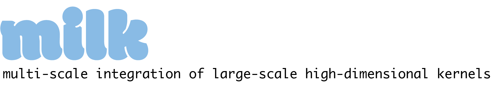
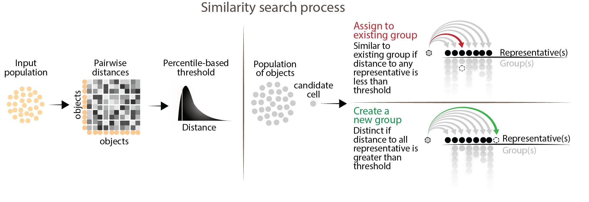
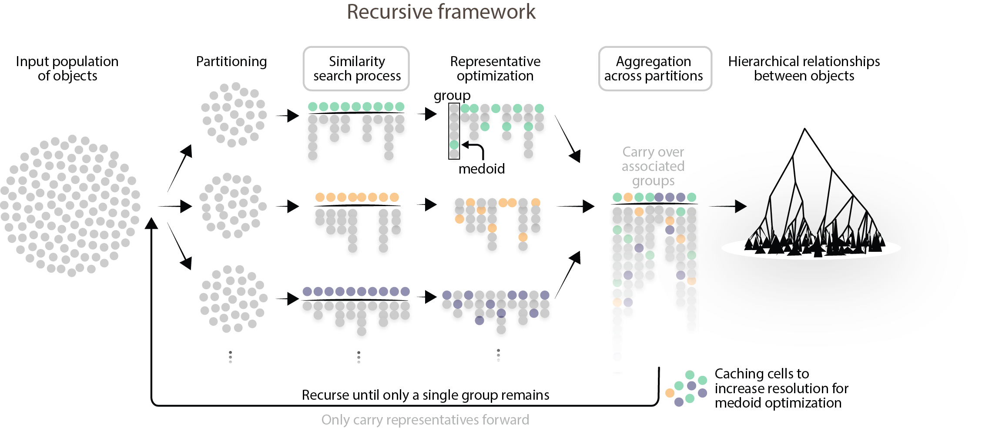

# Overivew

To address the rapid growth of high-dimensional data in biology and other fields, we present MILK, a scalable approach for capturing highly granular relationships between objects (e.g., single cells). By recursively stratifying the population into groups of highly similar objects based on pairwise distance, MILK builds a hierarchical organization of objects that preserves both global structure and rare local subpopulations. This provides a framework for multi-resolution analysis of ultra-large datasets in a tractable and interpretable manner.



The main process of MILK groups highly similar objects using a data-driven similarity threshold defined by a lower-tail percentile (e.g., 0.1%) of distances. In a single-pass through the dataset, each candidate object is compared to the representatives of existing groups. If the candidate has a distance below the threshold to any group, it is mapped to the group it is most similar to; otherwise, it is considered distinct, in which case it forms a new group and becomes its representative. The first candidate object forms a new group by default.



To handle datasets that exceed available memory, MILK employs a recursive, out-of-core strategy that involves partitioning the population into tractable subsets and processing them with a shared global similarity threshold. After identifying groups within each subpopulation, representatives are optimized to be the medoid of each group. All groups are then aggregated into a global list and, if tractable, an additional grouping process is performed on the representatives to resolve potential overlap across partitions.
By carrying forward only representatives, this pipeline can be applied recursively to progressively merge groups according to the percentile-based similarity threshold. If allowed to run to completion, a global hierarchical structure is produced over the complete population.


# Installation

TODO

# Usage

```
usage: milk -i INPUT-PATH [-b BATCH-SIZE] [-n SAMPLE-SIZE]
            [-c CACHE-SIZE-LIMIT] [-p PARTITION-SIZE]
            [-M MERGE-THRESHOLD] [-P COMPILE-PREVIOUS-THRESHOLD]
            [-m METRIC] [-l LABEL] [-t PERCENTILE] [-T THREADS]
            [-r SEED] [--job-scheduler JOB-SCHEDULER]
            [--job-account JOB-ACCOUNT] [--job-name JOB-NAME]
            [--job-memory JOB-MEMORY] [--job-time JOB-TIME]
            [--environment-path ENVIRONMENT-PATH] [--verbose]
            [--skip-reconstruction] [-o OUTPUT-DIR] [-h]

optional arguments:
  -i, --input-path INPUT-PATH
                        Uncompressed CSV file. First column
                        corresponds to object IDs (e.g., cell
                        barcode). No header
  -b, --batch-size BATCH-SIZE
                        [HPC mode] The number of partitioned input
                        files to be assigned per job. (type: Int64,
                        default: 50)
  -n, --sample-size SAMPLE-SIZE
                        Sample size threshold for the number of groups
                        required to stop the recursive grouping
                        process. Recursion stops when the number of
                        (representative) objects is less than or equal
                        to this value. (type: Int64, default: 1)
  -c, --cache-size-limit CACHE-SIZE-LIMIT
                        How many (representative) objects to cache for
                        medoid optimization in subsequent recursions.
                        (type: Int64, default: 50000)
  -p, --partition-size PARTITION-SIZE
                        How many objects per partitioned file. (type:
                        Int64, default: 10000)
  -M, --merge-threshold MERGE-THRESHOLD
                        Threshold of when to carry out an additional
                        merging stratification process (if exceeded,
                        basic concatenation to join partitioned
                        groups) (type: Int64, default: 100000)
  -P, --compile-previous-threshold COMPILE-PREVIOUS-THRESHOLD
                        Only carry forward previous groups if the
                        number of representatives is below this
                        threshold (tractability). TODO maybe delete
                        (type: Int64, default: 1000000)
  -m, --metric METRIC   Distance metric for pairwise comparisons.
                        Permissible values: {'cosine','euclidean'})
                        (default: "euclidean")
  -l, --label LABEL     Specify string label for file names.
  -t, --percentile PERCENTILE
                        Threshold for stratification process to group
                        cells. (type: Float64, default: 1.0)
  -T, --threads THREADS
                        Number of distributed processes for computing
                        pairwise comparisons. (TODO change to n_cpus)
                        (type: Int64, default: 1)
  -r, --seed SEED       Random seed. (type: Int64, default: 21)
  --job-scheduler JOB-SCHEDULER
                        [HPC mode] Job scheduler to distribute
                        partitioned batches of stratification
                        processes. Supported schedulers:
                        {'slurm','sge'} (default: "slurm")
  --job-account JOB-ACCOUNT
                        [HPC mode] Account name associated with
                        account (only for SLURM job scheduler).
  --job-name JOB-NAME   [HPC mode] Job names (default: "milk")
  --job-memory JOB-MEMORY
                        [HPC mode] Memory of jobs (in gigabytes).
                        (type: Int64, default: 4)
  --job-time JOB-TIME   [HPC mode] Allotted time for jobs (only for
                        SLURM job scheduler). (default: "24:00:00")
  --environment-path ENVIRONMENT-PATH
                        [HPC mode] Bash script to set up environment
                        in submitted jobs.
  --verbose             Amount of information written to standard
                        out/err.
  --skip-reconstruction
                        Only perform hierarchical
                        grouping/downsampling phase and NOT the
                        additional step of reconstructing vertices and
                        edges table for graph structure.
  -o, --output-dir OUTPUT-DIR
                        Directory to write intermediate and output
                        files. (default: ".")
  -h, --help            show this help message and exit
```

## Example usage

TODO

### Input

TODO

### Output

TODO

## High Performance Computing mode

TODO

# Paper

TODO