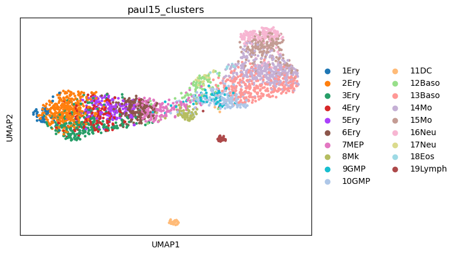
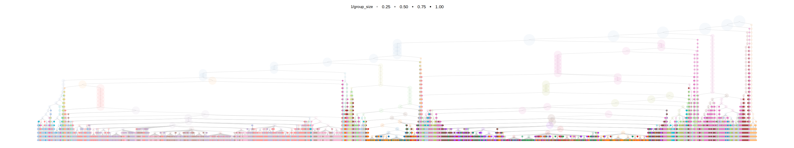
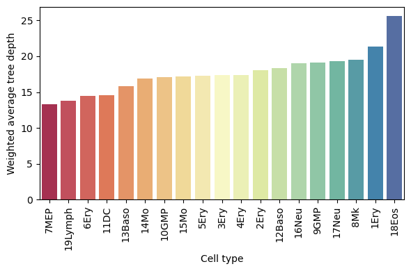
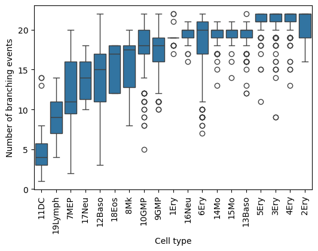
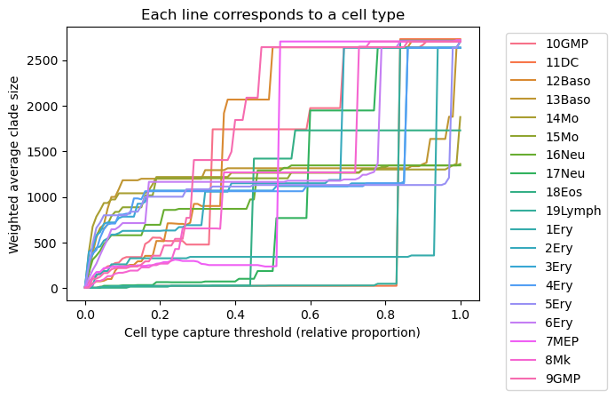
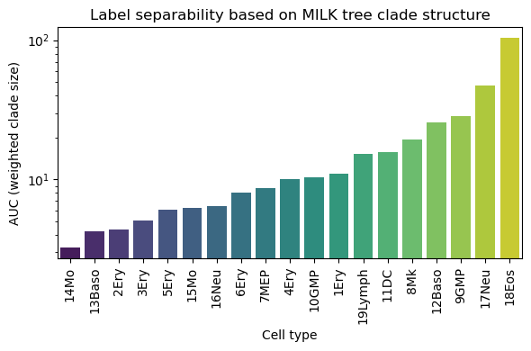

# MILK tutorial: Quantifying dynamic cellular information with MILK trees (Paul15 dataset)

## Overview

Hierarchical encoding of datasets provided by MILK trees can inherently capture dynamic aspects of individual cells. That is, we have come to appreciate that cells lie on a continuum with respect to their underlying gene expression profiles, and identification of such an "ordering" of cells can provide insights allowing us to try and explain processes like single-cell developmental trajectories. As such, this tutorial will provide a walkthrough of applying MILK to the transcriptomic profiling of myeloid progenitor cells as they undergo lineage commitment.

The following analyses are included:

1. Quantify the (weighted) average tree depth at which each of the annotated cell types branch off in the MILK tree.
2. Calculate the number of single-cell branching events with respect to each cell type in the MILK tree.
3. Calculate the average clade size required to robustly capture the cell type of interest in the MILK tree according to a threshold (summarized by area under the curve).

These analyses aim to provide simple examples of how cell type-specific branching patterns emerge from the global MILK hierarchy.

Citation:
> Paul F, Arkin Y, Giladi A, Jaitin DA, Kenigsberg E, Keren-Shaul H, Winter D, Lara-Astiaso D, Gury M, Weiner A, David E, Cohen N, Lauridsen FK, Haas S, Schlitzer A, Mildner A, Ginhoux F, Jung S, Trumpp A, Porse BT, Tanay A, Amit I. Transcriptional Heterogeneity and Lineage Commitment in Myeloid Progenitors. Cell. 2015 Dec 17;163(7):1663-77. doi: 10.1016/j.cell.2015.11.013. Epub 2015 Nov 25. Erratum in: Cell. 2016 Jan 14;164(1-2):325. PMID: 26627738.

## Importing libraries
```python
import os
import pathlib
import pandas as pd
import scanpy as sc
```

## Loading the dataset
The dataset was downloaded through Scanpy as follows:


```python
adata = sc.datasets.paul15()
```

This loads the dataset as an `anndata` object with 2730 cells and 3451 genes. It also includes cluster (i.e., cell type) annotations via `adata.obs['paul15_clusters']` and root information used in their trajectory inference analyses (`adata.uns['iroot']`).


```python
adata.obs.head()
```

<div style="overflow-x: auto;">
<style scoped>
    .dataframe tbody tr th:only-of-type {
        vertical-align: middle;
    }

    .dataframe tbody tr th {
        vertical-align: top;
    }

    .dataframe thead th {
        text-align: right;
    }
</style>
<table border="1" class="dataframe">
  <thead>
    <tr style="text-align: right;">
      <th></th>
      <th>paul15_clusters</th>
    </tr>
  </thead>
  <tbody>
    <tr>
      <th>W31105</th>
      <td>7MEP</td>
    </tr>
    <tr>
      <th>W31106</th>
      <td>15Mo</td>
    </tr>
    <tr>
      <th>W31107</th>
      <td>3Ery</td>
    </tr>
    <tr>
      <th>W31108</th>
      <td>15Mo</td>
    </tr>
    <tr>
      <th>W31109</th>
      <td>3Ery</td>
    </tr>
  </tbody>
</table>
</div>


## Standard pre-processing

```python
sc.pp.filter_cells(adata,min_genes=100)
sc.pp.filter_genes(adata,min_cells=3)
sc.pp.normalize_total(adata)
sc.pp.log1p(adata)
# only considering highly variable genes
sc.pp.highly_variable_genes(adata)
adata = adata[:,adata.var.highly_variable].copy()
```

This processing resulted in a dataset with 2730 cells and 657 (highly variable) genes.


---
Initially, we can just plot the UMAP of the dataset to get an overview.


```python
sc.tl.pca(adata)
sc.pp.neighbors(adata, n_neighbors=15, n_pcs=50)
sc.tl.umap(adata)
sc.pl.umap(adata,color="paul15_clusters")
```


    
## MILK input

We can apply MILK on the PCA embeddings (50 components) of the processed dataset. The data is written as a `.CSV` file with no header, where the first column corresponds to cell ID.


```python
input_df = pd.DataFrame(adata.obsm["X_pca"],index=adata.obs_names)
input_df.to_csv("input.csv",header=False)
```

The table below depicts an excerpt of the input table:

<div style="overflow-x: auto;">
<style scoped>
    .dataframe tbody tr th:only-of-type {
        vertical-align: middle;
    }

    .dataframe tbody tr th {
        vertical-align: top;
    }

    .dataframe thead th {
        text-align: right;
    }
</style>
<table border="1" class="dataframe">
  <tbody>
    <tr>
      <th>W31105</th>
      <td>-1.233177</td>
      <td>-3.490964</td>
      <td>1.909774</td>
      <td>-1.484107</td>
      <td>-0.530059</td>
      <td>-0.288270</td>
      <td>1.743168</td>
      <td>-1.370971</td>
      <td>-2.089372</td>
      <td>-0.942689</td>
      <td>...</td>
      <td>-1.575776</td>
      <td>0.464548</td>
      <td>0.166464</td>
      <td>0.470086</td>
      <td>0.999315</td>
      <td>0.081813</td>
      <td>-1.461119</td>
      <td>0.009120</td>
      <td>1.387228</td>
      <td>-1.308720</td>
    </tr>
    <tr>
      <th>W31106</th>
      <td>5.802759</td>
      <td>1.664820</td>
      <td>0.029968</td>
      <td>-1.420301</td>
      <td>1.231161</td>
      <td>0.887331</td>
      <td>1.160496</td>
      <td>-0.268688</td>
      <td>-0.145290</td>
      <td>-0.620861</td>
      <td>...</td>
      <td>0.037120</td>
      <td>0.006508</td>
      <td>0.874887</td>
      <td>0.170908</td>
      <td>0.631572</td>
      <td>0.652908</td>
      <td>0.785620</td>
      <td>-0.139065</td>
      <td>-0.111727</td>
      <td>-1.108846</td>
    </tr>
    <tr>
      <th>W31107</th>
      <td>-5.798246</td>
      <td>1.549633</td>
      <td>-0.080099</td>
      <td>0.738449</td>
      <td>-0.551667</td>
      <td>1.170946</td>
      <td>-0.120539</td>
      <td>-0.929517</td>
      <td>-0.421885</td>
      <td>-0.148952</td>
      <td>...</td>
      <td>0.485965</td>
      <td>-0.230995</td>
      <td>-0.158994</td>
      <td>-0.037129</td>
      <td>-0.187478</td>
      <td>0.069017</td>
      <td>-0.315388</td>
      <td>0.000821</td>
      <td>0.243239</td>
      <td>-0.119337</td>
    </tr>
    <tr>
      <th>W31108</th>
      <td>4.912524</td>
      <td>2.162220</td>
      <td>2.494962</td>
      <td>0.615529</td>
      <td>0.100325</td>
      <td>2.048262</td>
      <td>0.025773</td>
      <td>0.511106</td>
      <td>0.106394</td>
      <td>0.007073</td>
      <td>...</td>
      <td>-0.360207</td>
      <td>-0.187789</td>
      <td>0.512162</td>
      <td>0.036460</td>
      <td>-0.083043</td>
      <td>0.025471</td>
      <td>-0.791394</td>
      <td>0.075791</td>
      <td>-0.262446</td>
      <td>-0.603879</td>
    </tr>
    <tr>
      <th>W31109</th>
      <td>-5.867806</td>
      <td>1.969801</td>
      <td>-0.327709</td>
      <td>0.639971</td>
      <td>-0.684827</td>
      <td>1.480482</td>
      <td>0.323854</td>
      <td>-0.438390</td>
      <td>-0.019980</td>
      <td>-0.432133</td>
      <td>...</td>
      <td>0.756776</td>
      <td>0.077329</td>
      <td>-0.294401</td>
      <td>-0.188781</td>
      <td>0.025858</td>
      <td>-0.784789</td>
      <td>0.269851</td>
      <td>0.277555</td>
      <td>0.101574</td>
      <td>-0.243650</td>
    </tr>
  </tbody>
</table>
</div>

## Running MILK

In terminal:
```bash
milk -i input.csv
```
Below provides an example of what the standard output when running MILK should look like.

    [ Info: MILK
    [ Info: Using 1 worker(s) for distributed processing
    [ Info: Parsed Arguments:
    [ Info:   label: nothing
    [ Info:   percentile: 1.0
    [ Info:   batch-size: 50
    [ Info:   output-dir: ./milk.out
    [ Info:   merge-threshold: 100000
    [ Info:   sample-size: 1
    [ Info:   threads: 1
    [ Info:   cache-size-limit: 50000
    [ Info:   job-time: 24:00:00
    [ Info:   group-stratification-mode: false
    [ Info:   job-name: milk
    [ Info:   partition-size: 10000
    [ Info:   hpc-mode: false
    [ Info:   skip-reconstruction: false
    [ Info:   metric: euclidean
    [ Info:   verbose: false
    [ Info:   job-scheduler: nothing
    [ Info:   environment-path: nothing
    [ Info:   force-overwrite: true
    [ Info:   job-account: nothing
    [ Info:   job-memory: 4
    [ Info:   seed: 21
    [ Info:   input-path: input.csv
    [ Info: ==========
    [ Info: Iteration: 0 (2730 objects)
    [ Info: 	Caching 2730 objects from the following path: /home/brett/milk/tutorial/milk.out/input.iteration_00000000.input.csv
    [ Info: ========== Starting encapsulated recursions...
    [ Info: Iteration: 0 (2730 objects)
    [ Info: 	[input.iteration_00000000] 2040 groups (144 groups optimized); 2730 objects (2730 total); threshold: 3.491 (computed); 3725921 comparisons (1 CPU(s); cache); runtime: 0.01 min
    [ Info: 	2040 objects after recursive iteration.
    [ Info: Iteration: 1 (2040 objects)
    [ Info: 	[input.iteration_00000001] 1273 groups (176 groups optimized); 2040 objects (2730 total); threshold: 4.744 (computed); 2959095 comparisons (1 CPU(s); cache; previous_groupings); runtime: 0.01 min
    [ Info: 	1273 objects after recursive iteration.
    [ Info: Iteration: 2 (1273 objects)
    [ Info: 	[input.iteration_00000002] 833 groups (108 groups optimized); 1273 objects (2730 total); threshold: 5.8528 (computed); 2023858 comparisons (1 CPU(s); cache; previous_groupings); runtime: 0.0 min
    [ Info: 	833 objects after recursive iteration.

    [ ...

    [ Info: Iteration: 31 (2 objects)
    [ Info: 	[input.iteration_00000031] 1 groups (1 groups optimized); 2 objects (2730 total); threshold: 15.7195 (computed); 2731 comparisons (1 CPU(s); cache; previous_groupings); runtime: 0.0 min
    [ Info: 	1 objects after recursive iteration.
    ┌ Info: 
    └ Completed recursive downsampling procedure.
    [ Info: Reconstructing hierarchical graph...
    [ Info: Hierarchical reconstruction
    [ Info: 	Done!


## Processing the MILK output

```python
import numpy as np

from glob import glob
from tqdm import tqdm

# Visualization libraries
import seaborn as sns
import matplotlib.cm as cm
import matplotlib.pyplot as plt
import matplotlib.patches as mpatches
import matplotlib.colors as mcolors
import matplotlib.patches as mpatches

"""
Constructing a BioPython tree object from the MILK output.
"""
from Bio import Phylo
from Bio.Phylo.BaseTree import Tree,Clade
from collections import defaultdict,deque
```

The following functions can be used to create the tree object.


```python
def instantiate_node(node_id,info_dict):
    node = Clade(name=node_id)
    node_dict = info_dict[node_id]
    node.representative_id = node_dict["representative_id"]
    node.group_size = node_dict["group_size"]
    node.iteration = node_dict["iteration"]
    node.threshold = node_dict["threshold"]
    node.spread = node_dict["spread"]
    node.specificity = node_dict["specificity"]
    node.resolution = node_dict["resolution"]
    return node

def construct_tree_object(vertices_df,edges_df):
    """
    For each (parent) node, provide list of (children) subnodes (top is root; bottom refers to leaves)
    """
    descendents_dict = edges_df.groupby("source")["target"].apply(list).to_dict()
    max_iteration_df = vertices_df[vertices_df["iteration"] == vertices_df["iteration"].max()]

    root_id = max_iteration_df["node_id"].values[0]
    node_info_dict = vertices_df.set_index("node_id").to_dict(orient="index")

    root_node = instantiate_node(root_id,node_info_dict)
    queue = deque([root_node])
    while queue:
        clade = queue.popleft()
        subclades = []
        for sample_id in descendents_dict.get(clade.name,[]):
            subclade = instantiate_node(sample_id,node_info_dict)
            subclades.append(subclade)
            queue.append(subclade)
        clade.clades = subclades

    return Tree(root_node)
```


```python
# MILK output directory contains a vertices and edges table
vertices_path = os.path.join(".","milk.out","output","vertices.csv.gz")
vertices_df = pd.read_csv(vertices_path)

edges_path = os.path.join(".","milk.out","output","edges.csv.gz")
edges_df = pd.read_csv(edges_path)
```

Table with vertex (i.e., node) information:
<div style="overflow-x: auto;">
<style scoped>
    .dataframe tbody tr th:only-of-type {
        vertical-align: middle;
    }

    .dataframe tbody tr th {
        vertical-align: top;
    }

    .dataframe thead th {
        text-align: right;
    }
</style>
<table border="1" class="dataframe">
  <thead>
    <tr style="text-align: right;">
      <th></th>
      <th>node_id</th>
      <th>representative_id</th>
      <th>group_size</th>
      <th>iteration</th>
      <th>threshold</th>
      <th>spread</th>
      <th>specificity</th>
      <th>resolution</th>
    </tr>
  </thead>
  <tbody>
    <tr>
      <th>0</th>
      <td>W39010</td>
      <td>W39010</td>
      <td>1</td>
      <td>0</td>
      <td>0.0</td>
      <td>NaN</td>
      <td>NaN</td>
      <td>0</td>
    </tr>
    <tr>
      <th>1</th>
      <td>W31116</td>
      <td>W31116</td>
      <td>1</td>
      <td>0</td>
      <td>0.0</td>
      <td>NaN</td>
      <td>NaN</td>
      <td>0</td>
    </tr>
    <tr>
      <th>2</th>
      <td>W38090</td>
      <td>W38090</td>
      <td>1</td>
      <td>0</td>
      <td>0.0</td>
      <td>NaN</td>
      <td>NaN</td>
      <td>0</td>
    </tr>
    <tr>
      <th>3</th>
      <td>W37487</td>
      <td>W37487</td>
      <td>1</td>
      <td>0</td>
      <td>0.0</td>
      <td>NaN</td>
      <td>NaN</td>
      <td>0</td>
    </tr>
    <tr>
      <th>4</th>
      <td>W38983</td>
      <td>W38983</td>
      <td>1</td>
      <td>0</td>
      <td>0.0</td>
      <td>NaN</td>
      <td>NaN</td>
      <td>0</td>
    </tr>
  </tbody>
</table>
</div>

Table including edge information:
<div style="overflow-x: auto;">
<style scoped>
    .dataframe tbody tr th:only-of-type {
        vertical-align: middle;
    }

    .dataframe tbody tr th {
        vertical-align: top;
    }

    .dataframe thead th {
        text-align: right;
    }
</style>
<table border="1" class="dataframe">
  <thead>
    <tr style="text-align: right;">
      <th></th>
      <th>source</th>
      <th>target</th>
    </tr>
  </thead>
  <tbody>
    <tr>
      <th>0</th>
      <td>I1</td>
      <td>W39010</td>
    </tr>
    <tr>
      <th>1</th>
      <td>I1</td>
      <td>W31116</td>
    </tr>
    <tr>
      <th>2</th>
      <td>I1</td>
      <td>W38090</td>
    </tr>
    <tr>
      <th>3</th>
      <td>I1</td>
      <td>W37487</td>
    </tr>
    <tr>
      <th>4</th>
      <td>I1</td>
      <td>W38983</td>
    </tr>
  </tbody>
</table>
</div>

Refer to the [documentation](https://milk-trees.readthedocs.io/en/latest/usage.html#output) for more information on the output.

Creating the tree object:
```python
tree = construct_tree_object(vertices_df,edges_df)
```

## Visualizing the MILK tree in R (`ggraph` package)

```R
library(tidyverse)
library(ggraph)
library(igraph)
library(paletteer)
```

```R
milk_dir <- "/home/brett/milk/tutorial/milk.out"
vertices_path <- file.path(milk_dir,"output","vertices.csv.gz")
edges_path <- file.path(milk_dir,"output","edges.csv.gz")
metadata_path <- "/home/brett/milk/tutorial/metadata.csv"
```

Note the `metadata.csv` table is derived via the following call: `adata.obs.to_csv('metadata.csv').`

```R
metadata_df <- read.csv(metadata_path) %>% dplyr::rename(representative_id=X)
```

<div style="overflow-x: auto;">
<table class="dataframe">
<thead>
	<tr><th></th><th scope=col>representative_id</th><th scope=col>paul15_clusters</th><th scope=col>n_genes</th><th scope=col>leiden</th><th scope=col>paul15_clusters_colors</th></tr>
	<tr><th></th><th scope=col>&lt;chr&gt;</th><th scope=col>&lt;chr&gt;</th><th scope=col>&lt;int&gt;</th><th scope=col>&lt;int&gt;</th><th scope=col>&lt;chr&gt;</th></tr>
</thead>
<tbody>
	<tr><th scope=row>1</th><td>W31105</td><td>7MEP</td><td> 277</td><td>1</td><td>#e377c2</td></tr>
	<tr><th scope=row>2</th><td>W31106</td><td>15Mo</td><td>1021</td><td>3</td><td>#c49c94</td></tr>
	<tr><th scope=row>3</th><td>W31107</td><td>3Ery</td><td>1466</td><td>0</td><td>#279e68</td></tr>
	<tr><th scope=row>4</th><td>W31108</td><td>15Mo</td><td>1415</td><td>4</td><td>#c49c94</td></tr>
	<tr><th scope=row>5</th><td>W31109</td><td>3Ery</td><td>1505</td><td>0</td><td>#279e68</td></tr>
	<tr><th scope=row>6</th><td>W31110</td><td>15Mo</td><td> 795</td><td>2</td><td>#c49c94</td></tr>
</tbody>
</table>
</div>

Loading the vertices and edges table into R, but now joining the metadata information to the vertex table. Here, the metadata information is associated to internal nodes via the group's representative ID, which corresponds to the medoid of leaves for the respective clade defined by the internal node.

```R
vertices_df <- read.csv(vertices_path) %>% left_join(metadata_df,by="representative_id")
edges_df <- read.csv(edges_path)
g <- graph_from_data_frame(edges_df,vertices=vertices_df)
```

Visualization:
```R
p <- ggraph(g,layout="dendrogram",circular=F) + 
    geom_edge_diagonal(color="lightgray",width=0.25,alpha=0.75) +
    geom_node_point(
      aes(color=paul15_clusters_colors,size=group_size,alpha=1/group_size),
      stroke=0
    ) +
    scale_color_identity(name="Label") +
    scale_size(range=c(2,16),name="Group size",guide=F) +
    coord_cartesian(clip="off") +
    theme_minimal() + theme(
        legend.position="top",
        legend.text = element_text(size=12),
        panel.grid = element_blank(),
        axis.text = element_blank(),
        axis.title = element_blank(),
        plot.title = element_text(size=16,hjust=0.5),
    )
  
options(repr.plot.width=32,repr.plot.height=6)
print(p)
```
    

    

## Downstream analyses utilizing the MILK tree output

```python
# cell ID -> cell type
labels_dict = {}
for sample_id,label in zip(adata.obs_names,adata.obs["paul15_clusters"]):
    labels_dict[sample_id] = label

'''
This is just a count of the total number of cells of each cell type in the dataset.
'''
total_counts_dict = defaultdict(int)
for tip in tree.get_terminals():
    total_counts_dict[labels_dict[tip.representative_id]] += 1
```
The `total_counts_dict` summarizes the number of cells per cell type:

| Cell Type | Count |
|----------|------:|
| 10GMP    | 153   |
| 9GMP     | 63    |
| 13Baso   | 300   |
| 12Baso   | 69    |
| 14Mo     | 373   |
| 7MEP     | 167   |
| 17Neu    | 22    |
| 11DC     | 30    |
| 15Mo     | 186   |
| 16Neu    | 164   |
| 18Eos    | 9     |
| 19Lymph  | 31    |
| 3Ery     | 246   |
| 4Ery     | 124   |
| 2Ery     | 329   |
| 6Ery     | 173   |
| 5Ery     | 180   |
| 1Ery     | 43    |
| 8Mk      | 68    |

```python
''' For each clade, we can then get a clade-specific count of cell types
'''
for clade in tree.find_clades():
    clade_counts_dict = defaultdict(int)
    for tip in clade.get_terminals():
        clade_counts_dict[labels_dict[tip.representative_id]] += 1
    clade.clade_counts_dict = clade_counts_dict
```
We can further normalize the clade-specific counts with respect to each cell type by the total counts, storing the relative proportion/purity information per clade in a table as follows:

```python
treedepth_dict = tree.depths(unit_branch_lengths=True)
```


```python
results_dict = {
    "clade_name":[],
    "clade_size":[],
    "label":[],
    "clade_count":[],
    "prop":[],
    "purity":[],
    "treedepth":[]
}
for clade in tree.find_clades():
    for label,clade_count in clade.clade_counts_dict.items():
        results_dict["clade_name"].append(clade.name)
        results_dict["clade_size"].append(clade.group_size)
        results_dict["label"].append(label)
        results_dict["clade_count"].append(clade_count)
        results_dict["prop"].append(clade_count/total_counts_dict[label])
        results_dict["purity"].append(clade_count/clade.group_size)
        results_dict["treedepth"].append(treedepth_dict[clade])

results_df = pd.DataFrame(results_dict)
```
The `results_df` data frame looks like:

<div style="overflow-x: auto;">
<style scoped>
    .dataframe tbody tr th:only-of-type {
        vertical-align: middle;
    }

    .dataframe tbody tr th {
        vertical-align: top;
    }

    .dataframe thead th {
        text-align: right;
    }
</style>
<table border="1" class="dataframe">
  <thead>
    <tr style="text-align: right;">
      <th></th>
      <th>clade_name</th>
      <th>clade_size</th>
      <th>label</th>
      <th>clade_count</th>
      <th>prop</th>
      <th>purity</th>
      <th>treedepth</th>
    </tr>
  </thead>
  <tbody>
    <tr>
      <th>0</th>
      <td>I5973</td>
      <td>2730</td>
      <td>10GMP</td>
      <td>153</td>
      <td>1.0</td>
      <td>0.056044</td>
      <td>0</td>
    </tr>
    <tr>
      <th>1</th>
      <td>I5973</td>
      <td>2730</td>
      <td>9GMP</td>
      <td>63</td>
      <td>1.0</td>
      <td>0.023077</td>
      <td>0</td>
    </tr>
    <tr>
      <th>2</th>
      <td>I5973</td>
      <td>2730</td>
      <td>13Baso</td>
      <td>300</td>
      <td>1.0</td>
      <td>0.109890</td>
      <td>0</td>
    </tr>
    <tr>
      <th>3</th>
      <td>I5973</td>
      <td>2730</td>
      <td>12Baso</td>
      <td>69</td>
      <td>1.0</td>
      <td>0.025275</td>
      <td>0</td>
    </tr>
    <tr>
      <th>4</th>
      <td>I5973</td>
      <td>2730</td>
      <td>14Mo</td>
      <td>373</td>
      <td>1.0</td>
      <td>0.136630</td>
      <td>0</td>
    </tr>
  </tbody>
</table>
</div>

### Weighted average depth of each cell type in the MILK tree

For each cell type, we can compute the weighted average tree depth across all clades that capture the cell type (to a threshold of 0.10). The product of the relative proportion and purity of that the cell type label of interest across clades was used as the weight.

```python
results_dict = {
    "cell_type": [],
    "wavg_treedepth": []
}

'''
Only considering clades that capture at least 10% of the population.
This is primarily to denoise the noisy signal present at the level of
individual cells.
'''
threshold = 0.1

# compute weighted average treedepth per label
for label, subset_df in results_df.groupby("label"):
    _subset_df = subset_df[subset_df["prop"] >= threshold]

    wavg_depth = np.average(
      _subset_df["treedepth"],
      weights=np.multiply(_subset_df["prop"],_subset_df["purity"])
    )
  
    results_dict["cell_type"].append(label)
    results_dict["wavg_treedepth"].append(wavg_depth)

df_depth = pd.DataFrame(results_dict)
df_depth = df_depth.sort_values("wavg_treedepth") # sort by weighted average treedepth

plt.figure(figsize=(6,4))
sns.barplot(data=df_depth,x="cell_type",y="wavg_treedepth",hue="cell_type",palette="Spectral")
plt.xticks(rotation=90)
plt.ylabel("Weighted average tree depth")
plt.xlabel("Cell type")
plt.tight_layout()
plt.show()
```
    

    
This shows a cell type-specific bias in the MILK tree topology, where a lower depth corresponds to branching higher (towards the root) in the MILK tree and a lower depth is more towards the leaves.

### Calculating the number of (productive) branching events from each cell (leaf) to the root

A productive branching event is defined as an internal node with at least 2 children. The resulting count values can be stratified by cell type group and normalized by the total number of cells per group.

This analysis offers a slightly different interpretation, since the number of hierarchical branching events reflects the degree of lineage "fragmentation" in the inferred topology. For example, higher values indicate that a cell type tends to reside in regions of the tree with more successive subdivisions, suggesting a more refined or partitioned lineage structure.

```python
leaf_branching_counts_dict = {}
for tip in tqdm(tree.get_terminals()):
    path = tree.get_path(tip.name) # returns list of nodes from leaf ("tip") to root
    leaf_branching_counts_dict[tip.name] = sum(len(clade.clades) >= 2 for clade in path)

df_cells = pd.DataFrame([
    {"cell": k, "branching_count": v, "label": labels_dict[k]}
    for k, v in leaf_branching_counts_dict.items()
])

# order by median branching count per label (i.e., cell type)
median_order = df_cells.groupby("label")["branching_count"].median().sort_values().index

plt.figure(figsize=(6,4))
sns.boxplot(data=df_cells, x="label", y="branching_count",order=median_order)  # order by median
plt.xticks(rotation=90)
plt.xlabel("Cell type")
plt.ylabel("Number of branching events")
plt.show()
```
    

    
### Threshold-based quantification cell type substructure in the MILK tree topology 

An additional metric that may be useful is to quantify the average clade size required to robustly capture each cell type group across a range of thresholds. For a given threshold, this reflects how large a clade must be to achieve a specified level of label homogeneity, providing insight into how dispersed or consolidated a cell type is within the tree topology.

Evaluating this quantity across a continuum of thresholds produces a sigmoidl curve for each cell type. The resulting curves can be directly compared across cell types (e.g., shifts), and summarized (e.g., via AUC) to quantify relative topological separability within the tree.

```python
results_dict = {
    "label":[],
    "threshold":[],
    "wavg_clade_size":[]
}

for threshold in tqdm(np.arange(0,1.01,0.01)):
    for label,subset_df in results_df.groupby("label"):
        _subset_df = subset_df[subset_df["prop"] >= threshold]
        if _subset_df.shape[0] == 0: continue
        results_dict["label"].append(label)
        results_dict["threshold"].append(threshold)
        results_dict["wavg_clade_size"].append(np.average(_subset_df["clade_size"],weights=_subset_df["purity"]))

df = pd.DataFrame(results_dict)
```

The resulting data frame:

<div style="overflow-x: auto;">
<style scoped>
    .dataframe tbody tr th:only-of-type {
        vertical-align: middle;
    }

    .dataframe tbody tr th {
        vertical-align: top;
    }

    .dataframe thead th {
        text-align: right;
    }
</style>
<table border="1" class="dataframe">
  <thead>
    <tr style="text-align: right;">
      <th></th>
      <th>label</th>
      <th>threshold</th>
      <th>wavg_clade_size</th>
    </tr>
  </thead>
  <tbody>
    <tr>
      <th>0</th>
      <td>10GMP</td>
      <td>0.0</td>
      <td>6.948723</td>
    </tr>
    <tr>
      <th>1</th>
      <td>11DC</td>
      <td>0.0</td>
      <td>5.044474</td>
    </tr>
    <tr>
      <th>2</th>
      <td>12Baso</td>
      <td>0.0</td>
      <td>4.926507</td>
    </tr>
    <tr>
      <th>3</th>
      <td>13Baso</td>
      <td>0.0</td>
      <td>11.584472</td>
    </tr>
    <tr>
      <th>4</th>
      <td>14Mo</td>
      <td>0.0</td>
      <td>13.294418</td>
    </tr>
  </tbody>
</table>
</div>


```python
plt.figure(figsize=(6,4))
sns.lineplot(data=df, x="threshold", y="wavg_clade_size", hue="label")
plt.xlabel("Cell type capture threshold (relative proportion)")
plt.ylabel("Weighted average clade size")
plt.title("Each line corresponds to a cell type")
plt.legend(bbox_to_anchor=(1.05,1))
plt.show()
```
    


```python
# Summarizing with a normalized AUC value
auc_dict = {}
for label in df["label"].unique():
    sub = df[df["label"] == label]
    sub = sub.sort_values("threshold")
    auc = np.trapz(sub["wavg_clade_size"], x=sub["threshold"])
    auc_dict[label] = auc/total_counts_dict[label]
```

```python
auc_df = pd.DataFrame({
    "label": list(auc_dict.keys()),
    "auc_per_cell": list(auc_dict.values())
})
auc_df = auc_df.sort_values("auc_per_cell")

plt.figure(figsize=(6,4))
sns.barplot(data=auc_df, x="label", y="auc_per_cell",hue="label",palette="viridis")
plt.xticks(rotation=90)
plt.ylabel("AUC (weighted clade size)")
plt.xlabel("Cell type")
plt.yscale("log")
plt.title("Label separability based on MILK tree clade structure")
plt.tight_layout()
plt.show()
```


    
Overall, the resulting curves capture how well a given cell type is captured by the tree topology.

Cell types that maintain relatively large clade sizes across a wide range of thresholds indicate poor capture of that subpopulation by the MILK tree. This may be interesting from the standpoint of identifying labels that appear to be more dispersed throughout the topology, which could potentially identify poor quality labels.

If a cell type can be robustly captured by a small clade size across a range of thresholds, it indicates stronger topological coherence (i.e., separability within the hierarchy).

Thus, differences in curve shape and AUC provide a quantitative measure of how distinctly each cell type is organized in the inferred single-cell topology.

