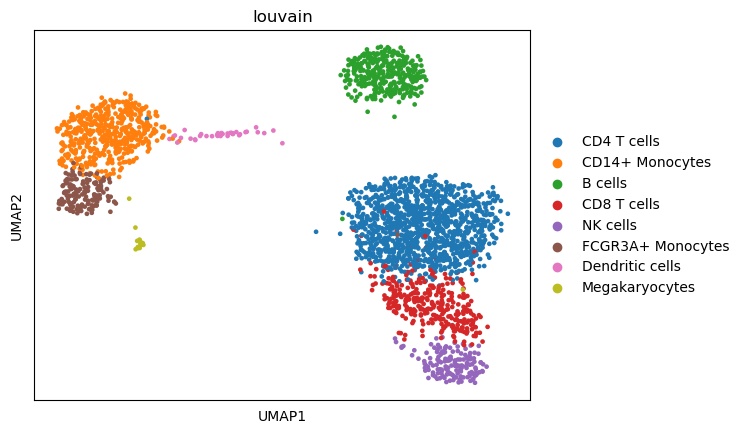
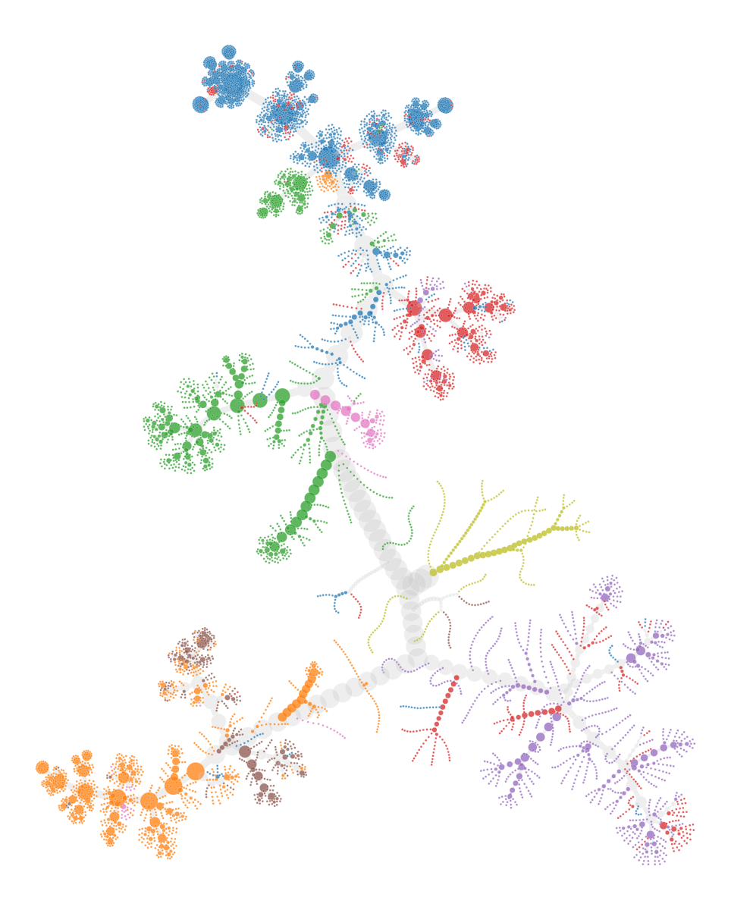

# MILK tutorial: Network visualization of MILK trees PBMC (3k dataset)

This notebook provides a basic walkthrough of how MILK can be applied to scRNA-seq datasets. Specifically, using the processed 3k PBMCs from 10X Genomics obtained from the ["Preprocessing and clustering 3k PBMCs (legacy workflow)"](https://scanpy.readthedocs.io/en/stable/generated/scanpy.datasets.pbmc3k_processed.html), which is provided by Scanpy.

## Importing libraries

```python
import os
import pathlib
import numpy as np
import pandas as pd
import scanpy as sc
```

## Loading the dataset

```python
adata = sc.datasets.pbmc3k_processed()
```
The processed `anndata` object contains the following information:

    AnnData object with n_obs × n_vars = 2638 × 1838
        obs: 'n_genes', 'percent_mito', 'n_counts', 'louvain'
        var: 'n_cells'
        uns: 'draw_graph', 'louvain', 'louvain_colors', 'neighbors', 'pca', 'rank_genes_groups'
        obsm: 'X_pca', 'X_tsne', 'X_umap', 'X_draw_graph_fr'
        varm: 'PCs'
        obsp: 'distances', 'connectivities'

Visualizing the processed dataset, colored by annotated cell types:
```python
sc.pl.umap(adata,color="louvain")
```


    

## MILK input

We can apply MILK to the PCA embeddings (50 components) of the processed dataset.

```python
input_df = pd.DataFrame(adata.obsm["X_pca"],index=adata.obs_names)
input_df.to_csv("input.csv",header=False)
```

<div style="overflow-x: auto; margin-bottom: 20px;">
<style scoped>
    .dataframe tbody tr th:only-of-type {
        vertical-align: middle;
    }

    .dataframe tbody tr th {
        vertical-align: top;
    }

    .dataframe thead th {
        text-align: right;
    }
</style>
<table border="1" class="dataframe">
  <tbody>
    <tr>
      <th>AAACATACAACCAC-1</th>
      <td>5.556233</td>
      <td>0.257714</td>
      <td>-0.186810</td>
      <td>2.800131</td>
      <td>-0.033783</td>
      <td>-0.189702</td>
      <td>0.310228</td>
      <td>-1.323691</td>
      <td>2.691945</td>
      <td>0.125928</td>
      <td>...</td>
      <td>-0.266174</td>
      <td>1.024464</td>
      <td>-0.709844</td>
      <td>-0.052780</td>
      <td>-0.686898</td>
      <td>-1.419867</td>
      <td>-2.865078</td>
      <td>0.027601</td>
      <td>2.671032</td>
      <td>-0.297620</td>
    </tr>
    <tr>
      <th>AAACATTGAGCTAC-1</th>
      <td>7.209530</td>
      <td>7.481985</td>
      <td>0.162706</td>
      <td>-8.018575</td>
      <td>3.012900</td>
      <td>0.322293</td>
      <td>2.270888</td>
      <td>-0.605055</td>
      <td>-0.905611</td>
      <td>1.225260</td>
      <td>...</td>
      <td>0.158161</td>
      <td>0.819037</td>
      <td>0.578912</td>
      <td>-1.169742</td>
      <td>0.955408</td>
      <td>0.068133</td>
      <td>-0.883082</td>
      <td>2.930932</td>
      <td>0.354197</td>
      <td>-1.081801</td>
    </tr>
    <tr>
      <th>AAACATTGATCAGC-1</th>
      <td>2.694438</td>
      <td>-1.583658</td>
      <td>-0.663126</td>
      <td>2.205649</td>
      <td>-1.686360</td>
      <td>-1.965395</td>
      <td>-1.894999</td>
      <td>-1.522103</td>
      <td>1.914985</td>
      <td>-0.481202</td>
      <td>...</td>
      <td>-1.054254</td>
      <td>0.805932</td>
      <td>1.543282</td>
      <td>1.504834</td>
      <td>-0.831818</td>
      <td>-0.236549</td>
      <td>1.883515</td>
      <td>1.084782</td>
      <td>0.381470</td>
      <td>0.064662</td>
    </tr>
    <tr>
      <th>AAACCGTGCTTCCG-1</th>
      <td>-10.143295</td>
      <td>-1.368530</td>
      <td>1.209812</td>
      <td>-0.700096</td>
      <td>-2.872336</td>
      <td>0.230617</td>
      <td>1.278005</td>
      <td>0.487900</td>
      <td>-0.447965</td>
      <td>-0.328465</td>
      <td>...</td>
      <td>1.297246</td>
      <td>0.611073</td>
      <td>-0.007878</td>
      <td>-0.648735</td>
      <td>0.543566</td>
      <td>3.156763</td>
      <td>1.691134</td>
      <td>-0.301377</td>
      <td>-0.225427</td>
      <td>0.962879</td>
    </tr>
    <tr>
      <th>AAACCGTGTATGCG-1</th>
      <td>-1.112816</td>
      <td>-8.152788</td>
      <td>1.332405</td>
      <td>-4.252473</td>
      <td>2.036407</td>
      <td>5.597797</td>
      <td>-0.110658</td>
      <td>-0.102257</td>
      <td>0.014520</td>
      <td>0.581409</td>
      <td>...</td>
      <td>1.191032</td>
      <td>1.042533</td>
      <td>1.734694</td>
      <td>-0.142114</td>
      <td>0.586381</td>
      <td>0.636326</td>
      <td>-1.451625</td>
      <td>1.809683</td>
      <td>-0.087072</td>
      <td>-0.737833</td>
    </tr>
  </tbody>
</table>
</div>

## MILK execution

### Exporting MILK directory to PATH


In terminal:
```bash
milk -i input.csv
```
The following is an excerpt of the standard output:

    [ Info: MILK
    [ Info: Using 1 worker(s) for distributed processing
    [ Info: Parsed Arguments:
    [ Info:   label: nothing
    [ Info:   percentile: 1.0
    [ Info:   batch-size: 50
    [ Info:   output-dir: ./milk.out
    [ Info:   merge-threshold: 100000
    [ Info:   sample-size: 1
    [ Info:   threads: 1
    [ Info:   cache-size-limit: 50000
    [ Info:   job-time: 24:00:00
    [ Info:   group-stratification-mode: false
    [ Info:   job-name: milk
    [ Info:   partition-size: 10000
    [ Info:   hpc-mode: false
    [ Info:   skip-reconstruction: false
    [ Info:   metric: euclidean
    [ Info:   verbose: false
    [ Info:   job-scheduler: nothing
    [ Info:   environment-path: nothing
    [ Info:   force-overwrite: true
    [ Info:   job-account: nothing
    [ Info:   job-memory: 4
    [ Info:   seed: 21
    [ Info:   input-path: input.csv
    [ Info: ==========
    [ Info: Iteration: 0 (2638 objects)
    [ Info: 	Caching 2638 objects from the following path: /home/brett/milk/tutorial/milk.out/input.iteration_00000000.input.csv
    [ Info: ========== Starting encapsulated recursions...
    [ Info: Iteration: 0 (2638 objects)
    [ Info: 	[input.iteration_00000000] 1723 groups (257 groups optimized); 2638 objects (2638 total); threshold: 10.4644 (computed); 3479378 comparisons (1 CPU(s); cache); runtime: 0.01 min
    [ Info: 	1723 objects after recursive iteration.
    [ Info: Iteration: 1 (1723 objects)
    [ Info: 	[input.iteration_00000001] 958 groups (220 groups optimized); 1723 objects (2638 total); threshold: 12.3272 (computed); 2361059 comparisons (1 CPU(s); cache; previous_groupings); runtime: 0.0 min
    [ Info: 	958 objects after recursive iteration.

    [ ...

    [ Info: Iteration: 31 (2 objects)
    [ Info: 	[input.iteration_00000031] 1 groups (1 groups optimized); 2 objects (2638 total); threshold: 50.5063 (computed); 2639 comparisons (1 CPU(s); cache; previous_groupings); runtime: 0.0 min
    [ Info: 	1 objects after recursive iteration.
    ┌ Info: 
    └ Completed recursive downsampling procedure.
    [ Info: Reconstructing hierarchical graph...
    [ Info: Hierarchical reconstruction
    [ Info: 	Done!


## Visualization of the single-cell MILK tree embedding

```python
import numpy as np

from glob import glob
from tqdm import tqdm

import graph_tool.all as gt

import seaborn as sns
import matplotlib.cm as cm
import matplotlib.pyplot as plt
import matplotlib.patches as mpatches
import matplotlib.colors as mcolors

from Bio import Phylo
from Bio.Phylo.BaseTree import Tree,Clade
from collections import defaultdict,deque
```


```python
gt.openmp_set_num_threads(1)
```

These Python functions construct a BioPython tree object from the MILK output files:
```python
def instantiate_node(node_id,info_dict):
    node = Clade(name=node_id)
    node_dict = info_dict[node_id]
    node.representative_id = node_dict["representative_id"]
    node.group_size = node_dict["group_size"]
    node.iteration = node_dict["iteration"]
    node.threshold = node_dict["threshold"]
    node.spread = node_dict["spread"]
    node.specificity = node_dict["specificity"]
    node.resolution = node_dict["resolution"]
    return node

def construct_tree_object(vertices_df,edges_df):
    """
    For each (parent) node, provide list of (children) subnodes
    (top is root; bottom refers to leaves)
    """
    descendents_dict = edges_df.groupby("source")["target"].apply(list).to_dict()
    max_iteration_df = vertices_df[vertices_df["iteration"] == vertices_df["iteration"].max()]

    root_id = max_iteration_df["node_id"].values[0]
    node_info_dict = vertices_df.set_index("node_id").to_dict(orient="index")

    root_node = instantiate_node(root_id,node_info_dict)
    queue = deque([root_node])
    while queue:
        clade = queue.popleft()
        subclades = []
        for sample_id in descendents_dict.get(clade.name,[]):
            subclade = instantiate_node(sample_id,node_info_dict)
            subclades.append(subclade)
            queue.append(subclade)
        clade.clades = subclades

    return Tree(root_node)
```

```python
# MILK output directory contains a vertices and edges table
vertices_path = os.path.join(".","milk.out","output","vertices.csv.gz")
vertices_df = pd.read_csv(vertices_path)

edges_path = os.path.join(".","milk.out","output","edges.csv.gz")
edges_df = pd.read_csv(edges_path)
```

Table with vertex (i.e., node) information:
<div style="overflow-x: auto; margin-bottom: 20px;">
<style scoped>
    .dataframe tbody tr th:only-of-type {
        vertical-align: middle;
    }

    .dataframe tbody tr th {
        vertical-align: top;
    }

    .dataframe thead th {
        text-align: right;
    }
</style>
<table border="1" class="dataframe">
  <thead>
    <tr style="text-align: right;">
      <th></th>
      <th>node_id</th>
      <th>representative_id</th>
      <th>group_size</th>
      <th>iteration</th>
      <th>threshold</th>
      <th>spread</th>
      <th>specificity</th>
      <th>resolution</th>
    </tr>
  </thead>
  <tbody>
    <tr>
      <th>0</th>
      <td>CAATCGGAGAAACA-1</td>
      <td>CAATCGGAGAAACA-1</td>
      <td>1</td>
      <td>0</td>
      <td>0.000000</td>
      <td>NaN</td>
      <td>NaN</td>
      <td>0</td>
    </tr>
    <tr>
      <th>1</th>
      <td>TCGGTAGAGTAGGG-1</td>
      <td>TCGGTAGAGTAGGG-1</td>
      <td>1</td>
      <td>0</td>
      <td>0.000000</td>
      <td>NaN</td>
      <td>NaN</td>
      <td>0</td>
    </tr>
    <tr>
      <th>2</th>
      <td>TAGCCGCTTACGAC-1</td>
      <td>TAGCCGCTTACGAC-1</td>
      <td>1</td>
      <td>0</td>
      <td>0.000000</td>
      <td>NaN</td>
      <td>NaN</td>
      <td>0</td>
    </tr>
    <tr>
      <th>3</th>
      <td>I1</td>
      <td>CAATCGGAGAAACA-1</td>
      <td>3</td>
      <td>1</td>
      <td>10.464395</td>
      <td>9.64075</td>
      <td>6.0</td>
      <td>2</td>
    </tr>
    <tr>
      <th>4</th>
      <td>CCTCGAACACTTTC-1</td>
      <td>CCTCGAACACTTTC-1</td>
      <td>1</td>
      <td>0</td>
      <td>0.000000</td>
      <td>NaN</td>
      <td>NaN</td>
      <td>0</td>
    </tr>
  </tbody>
</table>
</div>

Table including edge information:
<div style="overflow-x: auto; margin-bottom: 20px;">
<style scoped>
    .dataframe tbody tr th:only-of-type {
        vertical-align: middle;
    }

    .dataframe tbody tr th {
        vertical-align: top;
    }

    .dataframe thead th {
        text-align: right;
    }
</style>
<table border="1" class="dataframe">
  <thead>
    <tr style="text-align: right;">
      <th></th>
      <th>source</th>
      <th>target</th>
    </tr>
  </thead>
  <tbody>
    <tr>
      <th>0</th>
      <td>I1</td>
      <td>CAATCGGAGAAACA-1</td>
    </tr>
    <tr>
      <th>1</th>
      <td>I1</td>
      <td>TCGGTAGAGTAGGG-1</td>
    </tr>
    <tr>
      <th>2</th>
      <td>I1</td>
      <td>TAGCCGCTTACGAC-1</td>
    </tr>
    <tr>
      <th>3</th>
      <td>I2</td>
      <td>CCTCGAACACTTTC-1</td>
    </tr>
    <tr>
      <th>4</th>
      <td>I3</td>
      <td>GAACCTGATGAACC-1</td>
    </tr>
  </tbody>
</table>
</div>

Refer to the [documentation](https://milk-trees.readthedocs.io/en/latest/usage.html#output) for more information on the output.

Creating the tree object:
```python
tree = construct_tree_object(vertices_df,edges_df)
```

Cell types annotated in this dataset:
```python
labels = sorted(adata.obs["louvain"].unique())
```

- B cells  
- CD14+ Monocytes  
- CD4 T cells  
- CD8 T cells  
- Dendritic cells  
- FCGR3A+ Monocytes  
- Megakaryocytes  
- NK cells  


```python
labels_dict = {}
for sample_id,label in zip(adata.obs_names,adata.obs["louvain"]):
    labels_dict[sample_id] = label
```


```python
color_dict = {}
for label,col in zip(adata.obs['louvain'].cat.categories,adata.uns["louvain_colors"]):
    color_dict[label] = tuple(list(mcolors.to_rgb(col))+[0.75])
```


```python
neutral_col = (0.75,0.75,0.75,0.25)
neutral_threshold = 0.8

g = gt.Graph(directed=False)

vertex_labels = g.new_vertex_property("vector<float>")
vertex_sizes = g.new_vertex_property("float")
edge_widths = g.new_edge_property("int")

root = g.add_vertex()
vertex_labels[root] = neutral_col # color_dict[labels_dict[tree.clade.representative_id]]
vertex_sizes[root] = np.log1p(tree.count_terminals())*2

stack = [(root,tree.clade)]
while stack:
    vertex,clade = stack.pop()
    for subclade in clade:
        subvertex = g.add_vertex()
        edge = g.add_edge(vertex,subvertex)
        representative_label = labels_dict[subclade.representative_id]
        representative_col = color_dict[representative_label]
        leaf_labels = []
        for leaf in subclade.get_terminals():
            leaf_labels.append(labels_dict[leaf.representative_id])
        prop_matching = np.mean([int(representative_label == label) for label in leaf_labels])

        '''
        I'm requiring at least 0.8 of the leaves (associated with the 
        respective clade) to have the same cell type in order for the clade
        to be colored. Otherwise, it will just be in gray. This can just help
        to visualize complex tree structures.
        '''
        if prop_matching >= neutral_threshold:
            vertex_labels[subvertex] = color_dict[labels_dict[subclade.representative_id]]
        else:
            vertex_labels[subvertex] = neutral_col
        vertex_sizes[subvertex] = np.log1p(subclade.count_terminals())*2
        edge_widths[edge] = np.log1p(subclade.count_terminals())

        stack.append((subvertex,subclade))

g.vertex_properties["cell_type"] = vertex_labels
g.vertex_properties["group_size"] = vertex_sizes
g.edge_properties["pen_width"]    = edge_widths
```

Scale force-directed network layout provided by the `graph_tool` Python library:
```python
pos = gt.sfdp_layout(g,C=10)
```

```python
gt.graph_draw(
    g,
    pos=pos,
    vertex_fill_color=vertex_labels,
    vertex_color=[1,1,1,0.5],
    edge_color=[0.75,0.75,0.75,0.25],
    edge_pen_width=edge_widths,
    vertex_size=vertex_sizes,
    output_size=(400,600),
    bg_color=None
)
```

    
We can compare it back to the UMAP embeddings.
```python
sc.pl.umap(adata,color="louvain")
```
    

